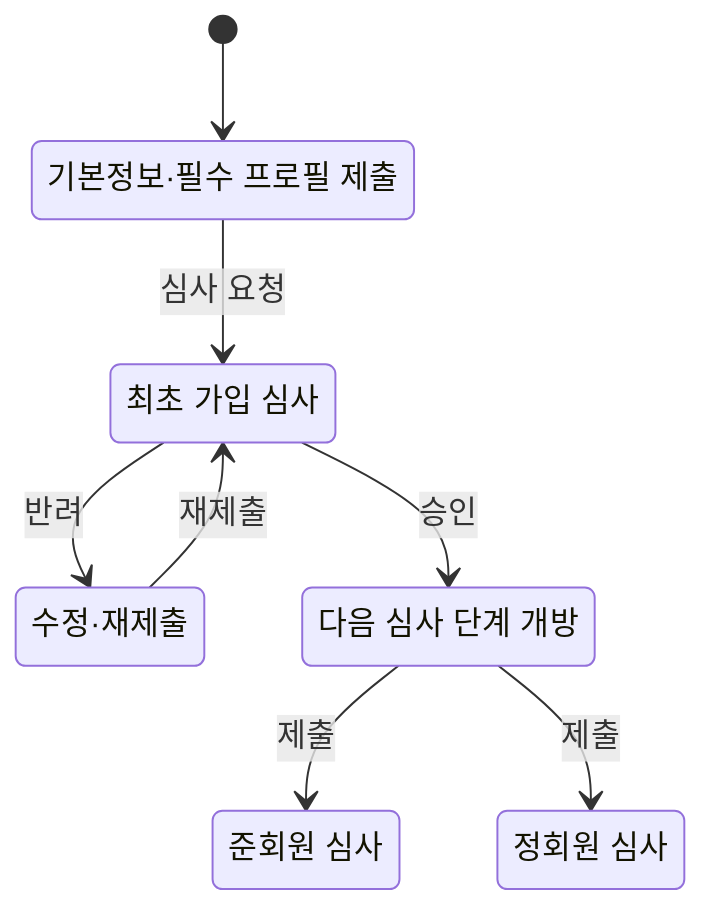
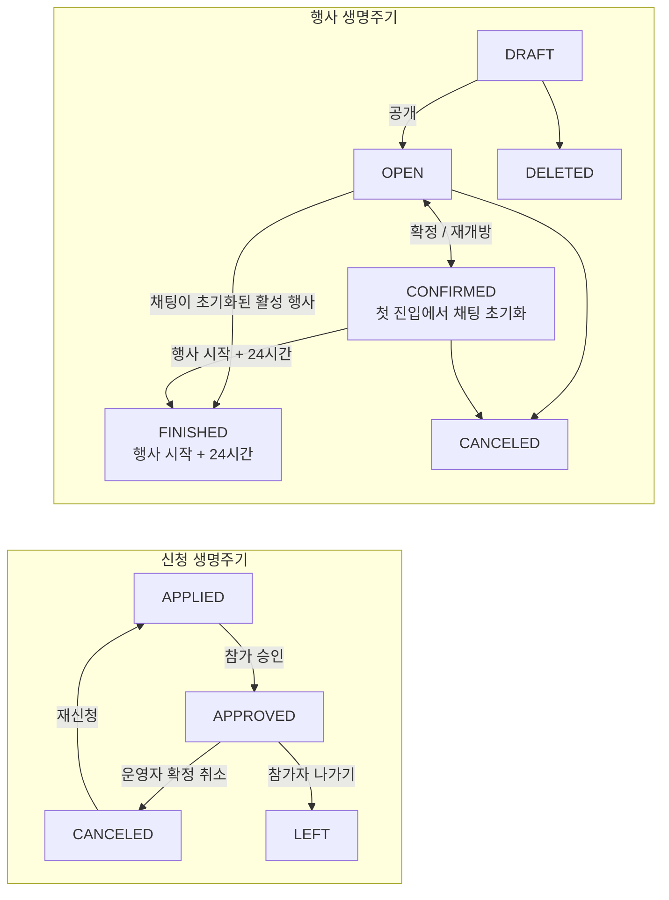
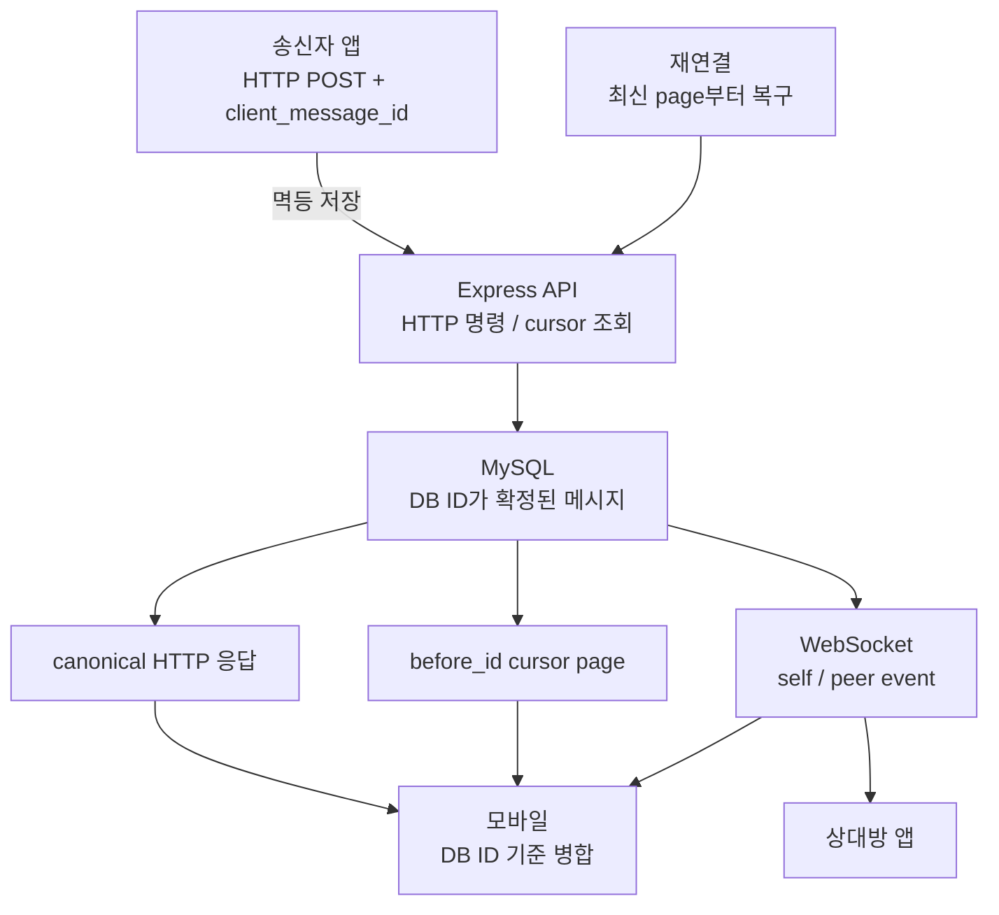

# Coupler

- 참여 기간: 2024.07 - 현재
- 유형: 모바일 소개팅 앱
- 구분: 외주 유지보수로 시작한 개인 프로젝트

## 역할과 책임

현재 React Native 모바일 앱, Express API, React 관리자 웹, MySQL DB의 개발과 운영을 총괄하고 있습니다.

- 기획 결정을 앱, API, 관리자 웹, DB 스키마와 마이그레이션에 반영합니다.
- QA, 코드 리뷰, 병합, 릴리스, 배포·롤백을 책임집니다.
- 정책·플로우·아키텍처, DB 변경 검증 절차, 배포·롤백 기준을 [공개 개발 문서](https://coupler-developer.github.io/docs/)로 정리하고 릴리스 기준에 연결합니다.

## 가입·심사 상태를 하나의 서버 응답으로 통일

**문제와 진단:** 기존 가입 신청은 약 30개 항목을 한 번에 입력해야 해 최초 심사 요청까지의 부담이 컸습니다. 더 큰 정합성 위험은 앱 화면, API 결과 코드, 관리자 심사 큐가 제출·재제출·승인·반려 상태와 다음 화면을 각자 추론하면서 서로 다른 흐름을 만들 수 있다는 점이었습니다.

**제약과 선택:** 기존 React Native 앱, Express API, React 관리자 웹, MySQL 데이터와 마이그레이션을 함께 바꿔야 했습니다. 클라이언트별 조건문을 맞추는 대신 API가 접근 상태와 다음 행동을 반환하는 단일 기준이 되고, 앱과 관리자 웹은 유효한 서버 상태만 해석하도록 선택했습니다. 상태가 없거나 유효하지 않으면 화면을 임의로 열지 않는 방향으로 처리했습니다.

**구현:** 기존 코드베이스를 2.0.0으로 전환하면서 최초 신청을 기본정보와 필수 프로필 중심으로 줄이고, 승인 뒤 준회원·정회원 심사를 독립적으로 진행하도록 상태 전이를 구현하고 DB 구조를 재구성했습니다. [회원가입 응답 계약](https://coupler-developer.github.io/docs/policy/signup-response-contract/)으로 성공 응답과 화면 분기 상태를 분리하고, [회원 심사 정책](https://coupler-developer.github.io/docs/policy/member-review-policy/)으로 제출·재제출, 가입 심사와 설정 수정 심사, 관리자 대기 큐의 분류 기준을 통일했습니다.

**검증과 결과:** API 응답 계약, 모바일 화면 분기, 관리자 심사 큐의 회귀 테스트를 같은 릴리스 확인 항목으로 운영했습니다. 변경은 [코드 리뷰 정책](https://coupler-developer.github.io/docs/policy/code-review-policy/)과 QA, 배포·롤백 절차로 확인했습니다.

Meta SDK 최초 가입 심사 도달 이벤트: 개편 전 약 10건, 개편 후 약 100건 관측

이 값은 최초 가입 심사 단계에 도달할 때 기록된 이벤트 횟수입니다.

## N:N 그룹미팅을 하나의 운영 생명주기로 연결

**문제와 진단:** 여러 회원과 운영자가 함께 움직이는 그룹미팅은 모집 상태, 신청 상태, 운영자 승인, 참가 확정, 채팅 접근, 종료, 후기 자격이 서로 다른 시점에 바뀝니다. 각 화면과 API가 이를 따로 추론하면 취소한 신청이 되살아나거나, 참가 확정 전에 채팅이 열리거나, 종료 뒤에도 쓰기가 가능한 상태 불일치가 생길 수 있었습니다.

**제약과 선택:** 기존 앱·API·관리자 웹·DB 안에서 기능을 추가하면서 운영자의 행사·참가자 관리와 사용자의 신청·재신청·나가기·채팅·후기를 함께 맞춰야 했습니다. 행사와 신청의 상태 흐름을 분리해 서버가 소유하고, 행사를 처음 확정할 때만 그룹 채팅을 만들며, 채팅 가능 시간과 종료 상태도 서버 시간으로 계산하도록 선택했습니다.

**구현:** API와 DB에 미팅·신청·참가·채팅·후기 상태를 구현하고, 관리자 웹에 생성·공개, 신청 승인·취소, 참가자·후기·신고를 처리하는 운영 화면을 연결했습니다. 팀원이 먼저 구성한 모바일 목록·상세·채팅 UI에는 신청 상태, 실시간 메시지 병합, 읽음 상태, 알림 표시, 재신청, 신고·후기 동작을 연결했습니다. 그룹 메시지는 REST로 저장하고 WebSocket으로 확정 메시지를 수신하도록 책임을 나눴습니다.

**검증과 결과:** 행사 공개·확정·재개방·종료와 신청·승인·나가기·재신청·후기의 상태 전이, API·관리자 웹·모바일 회귀 테스트를 릴리스 기준에 포함했습니다. 채팅은 최신 행사 시작일의 전날 13:00부터 열리고 행사 시작 시각 24시간 뒤부터 읽기 전용으로 전환됩니다. 이 생명주기는 [그룹미팅 시스템 문서](https://coupler-developer.github.io/docs/architecture/group-meeting-system/)로 고정하고 v2.3.0 범위로 출시했습니다.

## 추가 작업

### 세 가지 실시간 채팅과 1:1 누락 복구

curator, 1:1 매칭, N:N 그룹 채팅에 실시간 메시지와 읽지 않은 수 갱신을 연결했습니다. 세 채팅 모두 DB와 HTTP 조회를 영속 원본으로 두고 WebSocket은 확정 상태를 빠르게 전달하는 계층으로 사용했습니다. 아래 멱등 재시도와 cursor 복구는 그중 1:1 매칭 채팅에 적용한 구조입니다.

**문제와 진단:** 모바일 네트워크에서는 메시지 저장 성공 뒤 응답이 끊기거나, HTTP 응답과 송신자 WebSocket 이벤트가 겹치거나, 연결이 끊긴 동안 상대 메시지를 놓칠 수 있습니다. 재시도를 그대로 새 요청으로 처리하면 같은 메시지와 알림이 중복되고, WebSocket 수신만 신뢰하면 화면과 DB가 달라질 수 있었습니다.

**제약과 선택:** 메시지 전송은 HTTP 명령으로 DB에 먼저 저장하고, WebSocket은 서버가 확정한 메시지의 실시간 상태 전달을 담당하도록 책임을 분리했습니다. 클라이언트가 만든 `client_message_id`를 송신자 범위의 고유 키로 저장해 같은 요청을 안전하게 재시도하고, DB가 부여한 메시지 ID를 정렬·cursor·중복 병합의 기준으로 사용했습니다.

**구현과 검증:** 동일한 송신자와 `client_message_id`의 같은 payload가 다시 오면 최초 메시지를 반환하고 WebSocket과 알림을 다시 발행하지 않으며, 다른 payload로 키를 재사용하면 충돌로 거부합니다. 모바일은 HTTP 응답과 송·수신 WebSocket 이벤트를 DB 메시지 ID로 병합하고, 재연결이나 화면 복귀 때 최신 HTTP 페이지부터 이전 동기화 경계를 만날 때까지 `before_id` cursor를 따라가며 누락분을 합칩니다. 메시지 저장·중복 요청·payload 충돌·cursor 페이지와 모바일 재연결 병합을 회귀 테스트로 확인했습니다.

**확장 고려:** 현재 WebSocket fan-out은 단일 API 프로세스의 연결 집합을 사용합니다. 다중 인스턴스로 확장할 때는 인스턴스 간 이벤트 broker와 DB 저장 뒤 전달을 이어갈 outbox를 함께 도입할 수 있도록, 화면 복구의 원본은 HTTP와 DB에 유지했습니다.

### 중단 가능한 DB 마이그레이션과 복구 기준

**문제와 선택:** 운영 DB에서는 schema가 바뀌었는데 migration 기록이 남지 않거나, 중간 단계만 적용되거나, 이전 API가 새 schema에 계속 쓰는 상태를 함께 막아야 했습니다. 실행 대상과 순서를 immutable plan과 checksum으로 고정하고, 기존 쓰기와 외부 효과를 차단한 뒤 drain·backup·사전조건을 확인하도록 했습니다.

**구현과 검증:** 각 migration의 실행과 사후조건, durable ledger를 기록하는 중단형 실행기를 구현했습니다. 중단되면 fence를 유지하고 같은 plan을 확인한 뒤에만 재개하거나 복구합니다. 개발계에서는 관련 schema 변경이 적용되고 postcondition도 성공했지만 postcheck 기록만 누락된 상태를 확인해, 이 실행기로 해당 ledger gap만 복구했습니다. v2.3.0 운영 migration은 실행기 도입 전 변경이어서 새 실행기를 운영에서 실행했다고 소급하지 않고, live catalog·ledger gap·사후조건·schema fingerprint를 다시 확인해 종결했습니다. 이 기준은 [DB 마이그레이션 정책](https://coupler-developer.github.io/docs/policy/db-migration-gate-policy/)으로 관리합니다.

### 관리자 웹을 TypeScript로 전환하고 JavaScript 재유입을 CI로 차단

**문제와 진단:** 관리자 화면, 상태 저장소, 다국어 리소스가 JavaScript와 JSX로 작성되어 값의 형태와 응답 계약이 타입에 드러나지 않았습니다. 그 결과 느슨한 캐스트, 다국어 키 누락, 런타임 화면 오류를 전환 과정에서 함께 정리해야 했습니다.

**제약과 선택:** 운영 기능을 유지하면서 단계적으로 TypeScript와 TSX로 전환하고, 일회성 파일 변환에 그치지 않도록 `allowJs: false`와 타입 검사를 지속 기준으로 두었습니다.

**구현과 검증:** 관리자 웹의 JavaScript·JSX 코드를 TypeScript·TSX로 전환했습니다. GitHub Actions CI에서 typecheck를 실행하고, `src` 아래 JavaScript·JSX 파일과 느슨한 이중 캐스트가 다시 들어오면 실패하도록 전환 방지 검사를 추가했습니다.

## 관련 링크

- [Google Play](https://play.google.com/store/apps/details?id=com.ritzy.fourhundred&pli=1)
- [App Store](https://apps.apple.com/kr/app/id1645569179)
- [개발 문서](https://coupler-developer.github.io/docs/)
