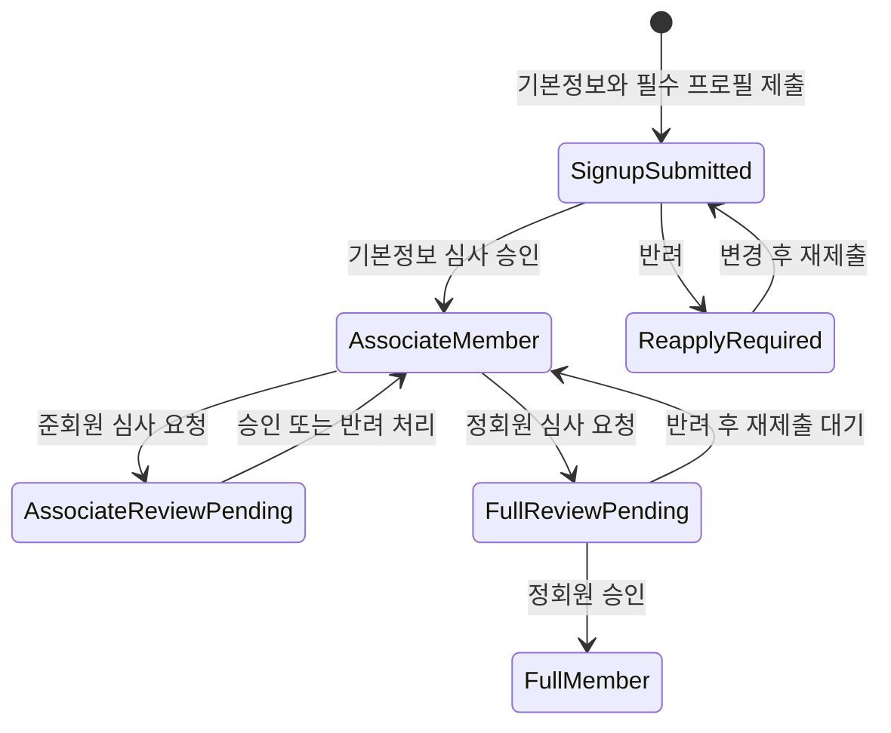
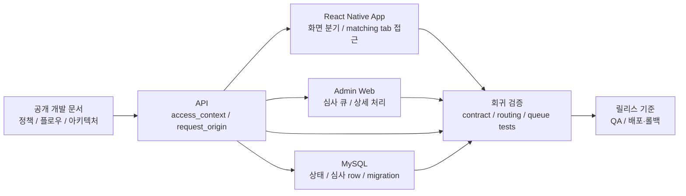

# Coupler

2024.07 - Present

- 유형: 외주 프로젝트

## 개요

React Native 기반 모바일 소개팅 앱 Coupler의 외주 프로젝트 개발총괄 작업입니다.
1.0.0 운영 이후 2.0.0 전환에서 약 30개 항목의 가입 신청을 단계형 심사 흐름으로 바꾸고, 앱 화면 흐름, API 응답, 관리자 심사 큐, DB 상태가 같은 가입·심사 모델을 따르도록 재구성했습니다.

## 역할과 범위

- 개발총괄 / Software Engineer
- 모바일 앱, API, 관리자 웹, DB 구조와 공개 개발 문서의 개발을 총괄합니다.
- 정책·플로우·아키텍처와 릴리스·배포/롤백 기준을 공개 개발 문서로 정리했습니다.
- 상태 계약, typecheck, migration guard, 회귀 검증을 통과한 변경만 제품에 반영합니다.

## 문제와 제약

React Native 제품을 1.0.0 초기 구현 이후 2.0.0까지 전환하면서 모바일 앱, API, 관리자 웹이 같은 가입·심사 상태 모델로 움직이도록 정리해야 했습니다.

기존 가입 신청은 약 30개 항목을 한 번에 입력해야 하는 구조였고, 심사 요청까지 도달하기 전에 사용자가 이탈할 수 있는 입력 부담이 컸습니다. 심사 단계와 화면 분기도 서버 응답 계약, 회원 심사 정책, 앱 화면, 관리자 심사 큐가 같은 상태값을 보도록 정리해야 했습니다.

## 대표 작업 흐름

핵심 작업은 한 번에 약 30개 항목을 입력하던 가입 신청을 기본정보와 필수 프로필 중심의 단계형 심사 흐름으로 줄이고, 제출·재제출·승인·반려 상태를 앱, API, 관리자 웹이 같은 상태값으로 판단하게 만든 것입니다.

## App / API / Admin 책임 경계

이 구조에서 제 역할은 제품 요구를 정책·플로우·아키텍처 문서, 서버 응답 계약, 앱 화면 분기, 관리자 심사 큐, DB 상태, 회귀 테스트, 릴리스·배포/롤백 확인 항목에 반영하는 것이었습니다.

## 설계와 구현

- 관리자 웹 TypeScript 전환과 typecheck CI/migration guard로 유지보수 방식을 고정했습니다.
- 회원가입과 심사 흐름을 사용 흐름과 [서버 응답 계약](https://github.com/coupler-developer/docs/blob/main/content/policy/signup-response-contract.md) 중심으로 분리해 화면 분기 로직을 단일화했습니다.
- 한 번에 약 30개 항목을 입력하던 가입 신청을 일반회원, 준회원, 정회원 단계로 나누고, 준회원·정회원 심사를 병렬로 제출하거나 탭을 이동하며 진행할 수 있도록 DB 구조와 상태 흐름을 재구성했습니다.
- Admin/Mobile/API가 같은 [회원 심사 정책](https://github.com/coupler-developer/docs/blob/main/content/policy/member-review-policy.md)을 쓰도록 제출/재제출 UX와 심사 목록 동작을 정리했습니다.
- [코드 리뷰 정책](https://github.com/coupler-developer/docs/blob/main/content/policy/code-review-policy.md)에 테스트, 문서 동기화, 회귀 안전성 확인 항목을 남겼습니다.

## 검증

- typecheck CI와 migration guard로 관리자 웹 TypeScript 전환 후 되돌아갈 수 있는 지점을 막았습니다.
- 회원가입 응답 계약과 회원 심사 정책으로 클라이언트 추측 라우팅과 심사 큐 중복 위험을 줄였습니다.

## 결과

2.0.0 전환 과정에서 모바일 앱, API, 관리자 웹, DB의 정책·플로우·아키텍처와 릴리스·배포/롤백 기준을 정리하고, 약 30개 항목을 한 번에 받던 가입 신청을 기본정보와 필수 프로필 중심의 단계형 심사 흐름으로 개편했습니다. 회원가입 응답 계약·회원 심사 정책·코드 리뷰 정책은 공개 개발 문서로 남겼습니다.

Meta SDK postback event count 기준으로 1개월 심사 요청 도달 event가 약 50건에서 약 1.1k 수준으로 증가한 것을 확인했습니다.

제품 운영 과정에서 고객·시장 반응을 제품 변경으로 빠르게 전환하면서, 모바일 앱, API, 관리자 웹, DB, 공개 개발 문서가 같은 상태 모델과 릴리스·배포/롤백 기준을 공유하도록 정리했습니다.

## 링크

- [Google Play](https://play.google.com/store/apps/details?id=com.ritzy.fourhundred&pli=1)
- [App Store](https://apps.apple.com/kr/app/id1645569179)
- [개발 문서](https://github.com/coupler-developer/docs)

## 산출물

- [공개 개발 문서 전체](https://github.com/coupler-developer/docs)
- [아키텍처 문서](https://github.com/coupler-developer/docs/tree/main/content/architecture)
- [플로우 문서](https://github.com/coupler-developer/docs/tree/main/content/flows)
- [릴리스 문서](https://github.com/coupler-developer/docs/tree/main/content/releases)
- [회원가입 응답 계약](https://github.com/coupler-developer/docs/blob/main/content/policy/signup-response-contract.md)
- [회원 심사 정책](https://github.com/coupler-developer/docs/blob/main/content/policy/member-review-policy.md)
- [코드 리뷰 정책](https://github.com/coupler-developer/docs/blob/main/content/policy/code-review-policy.md)

## 기술

React Native, TypeScript, Express, MySQL
