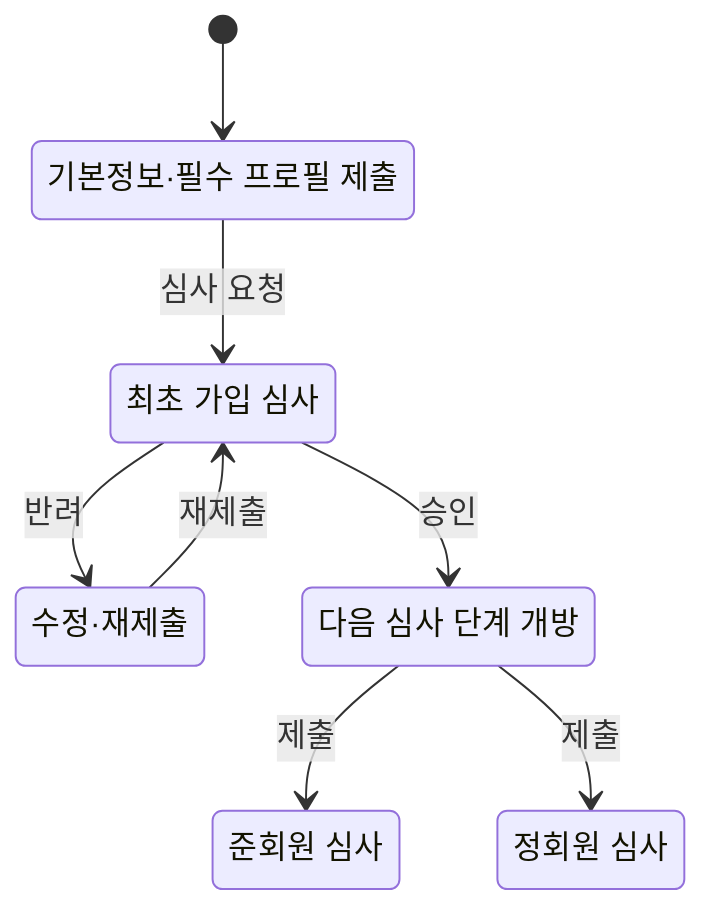
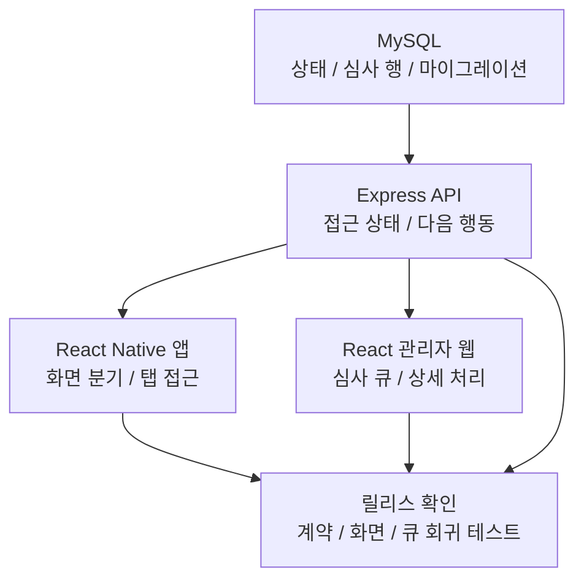

# Coupler

- 참여 기간: 2024.07 - 현재
- 유형: 모바일 소개팅 앱
- 구분: 외주 유지보수로 시작한 개인 프로젝트

## 역할과 책임

현재 React Native 모바일 앱, Express API, React 관리자 웹, MySQL DB의 개발과 운영을 총괄하고 있습니다.

- 기획 결정을 앱, API, 관리자 웹, DB 스키마와 마이그레이션에 반영합니다.
- QA, 코드 리뷰, 병합, 릴리스, 배포·롤백을 책임집니다.
- 정책·플로우·아키텍처, DB 변경 검증 절차, 배포·롤백 기준을 [공개 개발 문서](https://coupler-developer.github.io/docs/)로 정리하고 릴리스 기준에 연결합니다.

## 가입·심사 상태를 하나의 서버 응답으로 통일

**문제와 진단:** 기존 가입 신청은 약 30개 항목을 한 번에 입력해야 해 최초 심사 요청까지의 부담이 컸습니다. 더 큰 정합성 위험은 앱 화면, API 결과 코드, 관리자 심사 큐가 제출·재제출·승인·반려 상태와 다음 화면을 각자 추론하면서 서로 다른 흐름을 만들 수 있다는 점이었습니다.

**제약과 선택:** 기존 React Native 앱, Express API, React 관리자 웹, MySQL 데이터와 마이그레이션을 함께 바꿔야 했습니다. 클라이언트별 조건문을 맞추는 대신 API가 접근 상태와 다음 행동을 반환하는 단일 기준이 되고, 앱과 관리자 웹은 유효한 서버 상태만 해석하도록 선택했습니다. 상태가 없거나 유효하지 않으면 화면을 임의로 열지 않는 방향으로 처리했습니다.

**구현:** 기존 코드베이스를 2.0.0으로 전환하면서 최초 신청을 기본정보와 필수 프로필 중심으로 줄이고, 승인 뒤 준회원·정회원 심사를 독립적으로 진행하도록 상태 전이를 구현하고 DB 구조를 재구성했습니다. [회원가입 응답 계약](https://coupler-developer.github.io/docs/policy/signup-response-contract/)으로 성공 응답과 화면 분기 상태를 분리하고, [회원 심사 정책](https://coupler-developer.github.io/docs/policy/member-review-policy/)으로 제출·재제출, 가입 심사와 설정 수정 심사, 관리자 대기 큐의 분류 기준을 통일했습니다.

**검증과 결과:** API 응답 계약, 모바일 화면 분기, 관리자 심사 큐의 회귀 테스트를 같은 릴리스 확인 항목으로 운영했습니다. 변경은 [코드 리뷰 정책](https://coupler-developer.github.io/docs/policy/code-review-policy/)과 QA, 배포·롤백 절차로 확인했습니다.

## 가입·심사 개편 전후 Meta SDK 이벤트 관측

Meta SDK 최초 가입 심사 도달 이벤트: 개편 전 약 10건, 개편 후 약 100건 관측

이 값은 최초 가입 심사 단계에 도달할 때 기록된 이벤트 횟수입니다.

## 추가 작업

### 관리자 웹을 TypeScript로 전환하고 JavaScript 재유입을 CI로 차단

**문제와 진단:** 관리자 화면, 상태 저장소, 다국어 리소스가 JavaScript와 JSX로 작성되어 값의 형태와 응답 계약이 타입에 드러나지 않았습니다. 그 결과 느슨한 캐스트, 다국어 키 누락, 런타임 화면 오류를 전환 과정에서 함께 정리해야 했습니다.

**제약과 선택:** 운영 기능을 유지하면서 단계적으로 TypeScript와 TSX로 전환하고, 일회성 파일 변환에 그치지 않도록 `allowJs: false`와 타입 검사를 지속 기준으로 두었습니다.

**구현과 검증:** 관리자 웹의 JavaScript·JSX 코드를 TypeScript·TSX로 전환했습니다. GitHub Actions CI에서 typecheck를 실행하고, `src` 아래 JavaScript·JSX 파일과 느슨한 이중 캐스트가 다시 들어오면 실패하도록 전환 방지 검사를 추가했습니다.

## 관련 링크

- [Google Play](https://play.google.com/store/apps/details?id=com.ritzy.fourhundred&pli=1)
- [App Store](https://apps.apple.com/kr/app/id1645569179)
- [개발 문서](https://coupler-developer.github.io/docs/)
